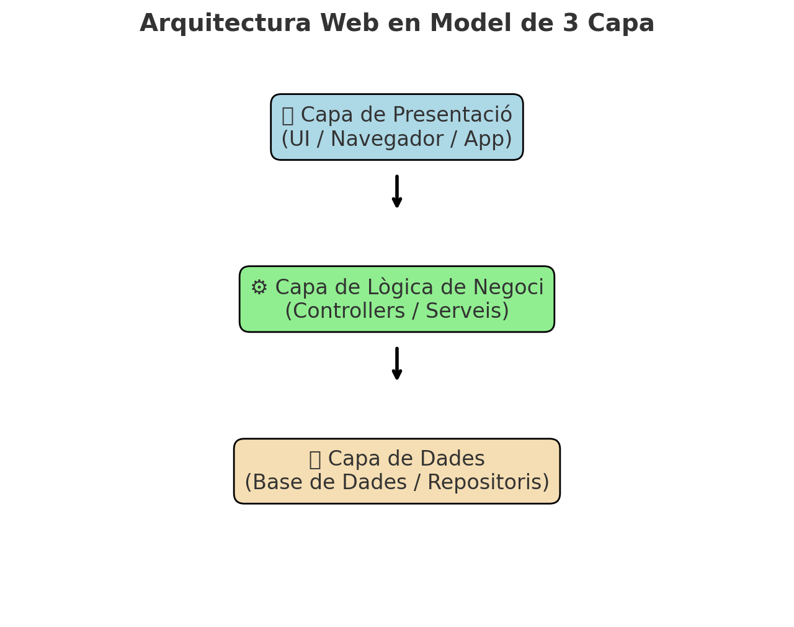
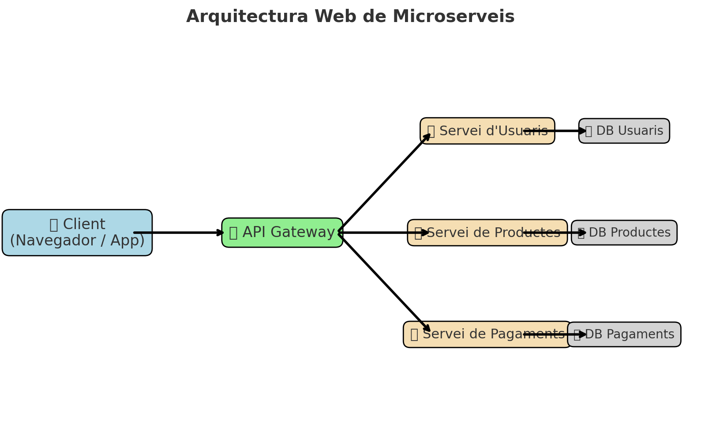

??? abstract "Duració i criteris d'avaluació"

    Duració estimada: 4 hores

    <hr />

    | Resultat d'aprenentatge | Criteris d'avaluació|
    | -------                 | -------             |
    | 1. Selecciona les arquitectures i tecnologies de programació web en entorn servidor, analitzant les seves capacitats i característiques pròpies.| a) S'han caracteritzat i diferenciat els models d'execució de codi en el servidor i en el client Web. <br/> b) S'han reconegut els avantatges que proporciona la generació dinàmica de pàgines Web i les seues diferències amb la inclusió de sentències de guions a l'interior de les pàgines Web. <br/> c) S'han identificat els mecanismes d'execució de codi en els servidors Web. <br/> d) S'han reconegut les funcionalitats que aporten els servidors d'aplicacions i la seua integració amb els servidors Web. <br/> e) S'han identificat i caracteritzat els principals llenguatges i tecnologies relacionats amb la programació Web en entorn servidor. <br/> f) S'han verificat els mecanismes d'integració dels llenguatges de marques amb els llenguatges de programació en entorn servidor. <br/> g) S'han reconegut i avaluat les eines i frameworks de programació en entorn servidor. <br/> |

# Arquitectures Web

Una arquitectura web defineix l'estructura i el comportament dels components d'una aplicació web, incloent com es comuniquen entre ells i amb els usuaris finals. Aquesta arquitectura pot abastar des de la interfície d'usuari en el client fins als serveis de backend i bases de dades en el servidor.

Les arquitectures web són fonamentals en el desenvolupament d'aplicacions web modernes per diverses raons:

- **Escalabilitat**:Les arquitectures ben dissenyades permeten que les aplicacions web gestionin un nombre creixent d'usuaris i dades sense sacrificar el rendiment. Per exemple, una arquitectura de microserveis facilita l'escalabilitat horitzontal, ja que cada servei es pot escalar independentment.
- **Mantenibilitat**:Una bona arquitectura facilita el manteniment i l'actualització de les aplicacions. Mitjançant la separació de preocupacions (per exemple, en una arquitectura de tres capes), es poden fer canvis en una part del sistema sense afectar altres parts.
- **Seguretat**:Les arquitectures web poden incorporar diverses capes de seguretat per protegir les dades i les comunicacions. Això inclou mesures com l'autenticació, l'autorització, la xifratge de dades, i la protecció contra atacs comuns com les injeccions SQL i el cross-site scripting (XSS).
- **Rendiment**:L'arquitectura de l'aplicació web afecta directament el seu rendiment. Una arquitectura ben dissenyada optimitza el temps de resposta i la gestió de recursos, millorant l'experiència de l'usuari. L'ús de tècniques com la caché, el balanç de càrrega, i la compressió de contingut són exemples d'estratègies per millorar el rendiment.
- **Flexibilitat i Adaptabilitat**:Les arquitectures modernes permeten l'ús de diverses tecnologies i eines per a diferents parts del sistema, proporcionant flexibilitat i permetent una adaptació ràpida als canvis tecnològics. Això és especialment rellevant amb l'adopció de pràctiques DevOps i l'ús de contenidors i orquestradors com Docker i Kubernetes.
- **Col·laboració i Desplegament**:Un bon disseny arquitectònic facilita la col·laboració entre equips de desenvolupament, ja que clarifica les responsabilitats i els punts d'integració. També permet un desplegament més eficient i automatitzat, reduint els riscos d'errors i millorant el temps de lliurament.

## Tipus d'Arquitectures Web

A continuació, es descriuen alguns dels principals tipus d'arquitectures web, cadascun amb les seves pròpies característiques, avantatges i desavantatges:

### Arquitectura Client-Servidor

En aquest model, el client (generalment un navegador web) envia sol·licituds al servidor, que processa aquestes sol·licituds i envia les respostes corresponents.

**Diagrama:**

<figure>
  
  <figcaption>Arquitectura Client Servidor</figcaption>
</figure>

**Característiques:**

- El client és responsable de la interfície d'usuari.
- El servidor maneja la lògica d'aplicació i l'accés a les dades.

**Avantatges:**

- Separació de responsabilitats.
- Facilita el manteniment i la seguretat.

**Desavantatges:**

- Pot tenir problemes de rendiment amb moltes sol·licituds simultànies.


### Arquitectura de Tres Capes

Aquesta arquitectura divideix l'aplicació en tres nivells: la capa de presentació, la capa de lògica d'aplicació, i la capa de dades.

**Diagrama:**

<figure>
  
  <figcaption>Arquitectura 3 capes</figcaption>
</figure>


**Característiques:**

- La capa de presentació gestiona la interfície d'usuari.
- La capa de lògica d'aplicació processa les dades i executa la lògica de negoci.
- La capa de dades emmagatzema i recupera la informació.

**Avantatges:**

- Facilita l'escalabilitat.
- Millora la seguretat, ja que les dades no són directament accessibles des del client.

**Desavantatges:**

- Pot ser més complexa de desenvolupar i mantenir.

### Arquitectura de Microserveis

Els microserveis descomponen una aplicació en una sèrie de serveis petits i independents, cadascun executant una funció específica.

**Diagrama:**

<figure>
  
  <figcaption>Arquitectura Microserveis</figcaption>
</figure>


**Característiques:**

- Cada microservei es pot desplegar, actualitzar, i escalar independentment.
- Utilitzen protocols lleugers com HTTP/REST o gRPC per comunicar-se.

**Avantatges:**

- Millora l'escalabilitat i la flexibilitat.
- Facilita l'ús de diferents tecnologies per a diferents serveis.

**Desavantatges:**

- Pot ser complexa de gestionar i coordinar.
- Requereix una infraestructura de desplegament i monitorització més robusta.

#### Recursos Addicionals

- **Documentació sobre Arquitectures de Software:** [Software Architecture Guide](https://martinfowler.com/architecture/)
- **Tutorial de Microserveis:** [Microservices Tutorial](https://www.tutorialspoint.com/microservice_architecture/index.htm)

#### Resum

Les arquitectures web són fonamentals per al desenvolupament d'aplicacions eficients i escalables. La selecció de l'arquitectura adequada depèn de les necessitats específiques del projecte, incloent-hi consideracions de rendiment, escalabilitat, seguretat i mantenibilitat.


# Pàgines Web Estàtiques vs. Dinàmiques

## Pàgines estàtiques

Les pàgines web estàtiques són aquelles en què el contingut no canvia en funció de les accions de l'usuari. Estan construïdes amb HTML i CSS, i cada pàgina es carrega de manera independent des del servidor.

#### Avantatges

- **Senzillesa:** Fàcils de crear i mantenir.
- **Rendiment:** Temps de càrrega ràpid perquè no requereixen processament addicional.
- **Seguretat:** Menys vulnerabilitats, ja que no hi ha lògica de servidor ni bases de dades.

#### Desavantatges

- **Flexibilitat:** Difícils de modificar a gran escala sense eines automatitzades.
- **Interactivitat:** Limitada, ja que no poden respondre a les accions de l'usuari de manera dinàmica.

#### Exemple Pràctic

```html
<!DOCTYPE html>
<html lang="en">
<head>
    <meta charset="UTF-8">
    <meta name="viewport" content="width=device-width, initial-scale=1.0">
    <title>Pàgina Estàtica</title>
    <style>
        body { font-family: Arial, sans-serif; }
        .content { margin: 20px; }
    </style>
</head>
<body>
<div class="content">
    <h1>Benvingut!</h1>
    <p>Aquesta és una pàgina web estàtica.</p>
</div>
</body>
</html>
```

## Pàgines dinàmiques

Les pàgines web dinàmiques són aquelles en què el contingut pot canviar en funció de les accions de l'usuari o altres factors. Utilitzen HTML, CSS, i JavaScript per al costat del client, i poden utilitzar llenguatges de servidor com PHP, Python, Node.js, entre altres, per generar contingut dinàmicament.
La generació dinàmica de pàgines web permet crear contingut web en temps real basat en les interaccions de l'usuari i les dades de la base de dades. Això proporciona una experiència d'usuari més rica i interactiva.

#### Avantatges

**Actualització en Temps Real**
- **Descripció:** Les pàgines es poden actualitzar automàticament sense necessitat de recarregar tota la pàgina.
- **Cas d'Ús:** Un portal de notícies que mostra articles nous sense necessitat de recarregar la pàgina.

**Personalització del Contingut**
- **Descripció:** Permet adaptar el contingut a les preferències i el comportament de l'usuari.
- **Cas d'Ús:** Una botiga en línia que mostra recomanacions de productes basades en l'historial de navegació i compres de l'usuari.

**Interactivitat Avançada**
- **Descripció:** Facilita la creació d'aplicacions web interactives que poden respondre a les accions de l'usuari en temps real.
- **Cas d'Ús:** Aplicacions de xarxes socials que mostren actualitzacions i notificacions en temps real.

**Gestió Eficient de Contingut**
- **Descripció:** Permet gestionar grans quantitats de contingut de manera més eficient, mostrant només el contingut rellevant en funció de la sol·licitud de l'usuari.
- **Cas d'Ús:** Un sistema de gestió de continguts (CMS) que permet als administradors editar i publicar articles de manera dinàmica.


#### Desavantatges

- **Complexitat:** Més difícils de crear i mantenir, ja que requereixen programació tant al client com al servidor.
- **Rendiment:** Poden ser més lentes a causa de la necessitat de processament al servidor.
- **Seguretat:** Exposades a més vulnerabilitats, com injeccions SQL, si no es prenen les precaucions adequades.

#### Impacte en Aplicacions Modernes

**Millora de l'Experiència d'Usuari**
- Les aplicacions modernes utilitzen la generació dinàmica de pàgines per oferir una experiència més fluida i responsiva. Per exemple, aplicacions com Gmail i Google Docs permeten als usuaris interactuar amb el contingut en temps real sense interrupcions.

**Optimització del Rendiment**
- La generació dinàmica de pàgines permet carregar només el contingut necessari, reduint la càrrega inicial i millorant el rendiment general de l'aplicació. Això és especialment útil en aplicacions complexes amb molta interactivitat.

**Capacitat de Resposta a les Sol·licituds de l'Usuari**
- Aplicacions com Facebook i Twitter utilitzen la generació dinàmica per actualitzar el feed en temps real, oferint als usuaris informació actualitzada immediatament.

#### Exemple Pràctic (PHP)

```php
<!DOCTYPE html>
<html lang="en">
<head>
    <meta charset="UTF-8">
    <meta name="viewport" content="width=device-width, initial-scale=1.0">
    <title>Pàgina Dinàmica</title>
    <style>
        body { font-family: Arial, sans-serif; }
        .content { margin: 20px; }
    </style>
</head>
<body>
    <div class="content">
        <h1>Benvingut!</h1>
        <p>Aquesta pàgina ha estat generada a les <?php echo date('H:i:s'); ?>.</p>
    </div>
</body>
</html>
```
### Comparativa entre Pàgines Web Estàtiques i Dinàmiques

| Característica              | Pàgines Web Estàtiques             | Pàgines Web Dinàmiques               |
|-----------------------------|------------------------------------|--------------------------------------|
| **Contingut**               | Fix, no canvia                     | Variable, pot canviar                |
| **Complexitat**             | Baixa                              | Alta                                 |
| **Interactivitat**          | Limitada                           | Alta                                 |
| **Rendiment**               | Alt                                | Pot ser baix                         |
| **Seguretat**               | Alta                               | Depèn de la implementació            |
| **Flexibilitat**            | Baixa                              | Alta                                 |
| **SEO**                     | Bona                               | Depèn de la implementació            |
| **Temps de Desenvolupament**| Curt                               | Llarg                                |
| **Actualització del Contingut** | Manual                         | Automàtica                           |
| **Cost de Manteniment**     | Baix       

<figure>
  
  <figcaption>Pàgina web dinàmica</figcaption>
</figure>

#### Recursos Addicionals

- [Article sobre els avantatges de les pàgines dinàmiques](https://www.example.com)
- [Curs sobre generació dinàmica de pàgines web](https://www.example.com)
- **Documentació de HTML:** [MDN HTML Guide](https://developer.mozilla.org/en-US/docs/Web/HTML)
- **Documentació de CSS:** [MDN CSS Guide](https://developer.mozilla.org/en-US/docs/Web/CSS)
- **Documentació de PHP:** [PHP Documentation](https://www.php.net/docs.php)
- **Documentació de JavaScript (MDN):** [MDN JavaScript Guide](https://developer.mozilla.org/en-US/docs/Web/JavaScript/Guide)
- **Documentació de Node.js:** [Node.js Documentation](https://nodejs.org/en/docs/)
- **Documentació de React:** [React Documentation](https://reactjs.org/docs/getting-started.html)

#### Resum

Les pàgines web estàtiques són adequades per a llocs web senzills amb contingut fix, mentre que les pàgines web dinàmiques són necessàries per a aplicacions més complexes que requereixen interactivitat i contingut variable. La decisió entre utilitzar una pàgina estàtica o dinàmica dependrà de les necessitats específiques del projecte i dels recursos disponibles. Les SPA ofereixen una experiència d'usuari molt rica però poden tenir desavantatges en termes de SEO i temps de càrrega inicial.

# Models d'Execució

Els models d'execució de codi en el desenvolupament web es poden dividir principalment en dos tipus: execució al client i execució al servidor. Cada model té les seves pròpies característiques, avantatges i desavantatges que cal considerar a l'hora de dissenyar una aplicació web.

## Execució de Codi al Client (FrontEnd)

L'execució de codi al client es realitza al navegador web de l'usuari. Els llenguatges utilitzats principalment per a l'execució al client són HTML, CSS i JavaScript.

#### Avantatges

- **Interactivitat:** Permet la creació d'experiències d'usuari riques i interactives.
- **Reducció de la càrrega del servidor:** El processament es fa al dispositiu de l'usuari, disminuint la càrrega del servidor.
- **Actualització instantània:** Canvis en l'UI poden ser reflectits immediatament sense necessitat de recarregar la pàgina.

#### Desavantatges

- **Seguretat:** El codi del client és visible i modificable pels usuaris, la qual cosa pot representar un risc de seguretat.
- **Compatibilitat:** Pot haver-hi diferències en la manera com diferents navegadors interpreten el codi.

Exemple de codi

```html
<!DOCTYPE html>
<html lang="en">
<head>
    <meta charset="UTF-8">
    <meta name="viewport" content="width=device-width, initial-scale=1.0">
    <title>Exemple Client</title>
    <style>
        body { font-family: Arial, sans-serif; }
        .content { margin: 20px; }
    </style>
</head>
<body>
    <div class="content">
        <h1>Hola, món!</h1>
        <button onclick="mostrarMissatge()">Fes clic aquí</button>
        <p id="missatge"></p>
    </div>

    <script>
        function mostrarMissatge() {
            document.getElementById('missatge').innerText = 'Has fet clic al botó!';
        }
    </script>
</body>
</html>
```

## Execució de Codi al Servidor (BackEnd)

L'execució de codi al servidor es realitza al servidor web abans que els resultats es retornin al navegador del client. Els llenguatges habituals inclouen PHP, Python, Ruby, Node.js, entre altres.

#### Avantatges

- **Seguretat:** El codi del servidor no és accessible pels usuaris finals, la qual cosa augmenta la seguretat.
- **Potència:** Els servidors solen ser més potents que els dispositius dels usuaris, permetent processar operacions més complexes.

#### Desavantatges

- **Latència:** Les sol·licituds al servidor poden ser lentes a causa de la distància física i la càrrega del servidor.
- **Escalabilitat:** Pot ser necessari més esforç per escalar una aplicació a mesura que augmenta el nombre d'usuaris.    

Exemple de codi
``` node.js
// server.js
const http = require('http');

const hostname = '127.0.0.1';
const port = 3000;

const server = http.createServer((req, res) => {
res.statusCode = 200;
res.setHeader('Content-Type', 'text/plain');
res.end('Hola, món!\n');
});

server.listen(port, hostname, () => {
console.log(`El servidor s'està executant a http://${hostname}:${port}/`);
});
```

## Single Page Application (SPA)

Una Single Page Application (SPA) és un tipus d'aplicació web que carrega una única pàgina HTML i dinàmicament actualitza el contingut a mesura que l'usuari interactua amb l'aplicació, utilitzant JavaScript per a gestionar la lògica i les actualitzacions de la interfície d'usuari.

#### Avantatges

- **Experiència d'usuari millorada:** Les SPA ofereixen una navegació més ràpida i fluida, similar a una aplicació d'escriptori.
- **Menys càrrega del servidor:** Menys sol·licituds al servidor ja que només es carrega una pàgina inicialment.
- **Desenvolupament modular:** Facilita la creació de components reutilitzables.

#### Desavantatges

- **SEO:** Les SPA poden ser menys amigables amb els motors de cerca.
- **Carregada inicial:** Pot requerir una major càrrega inicial de recursos, afectant el temps de càrrega inicial.
- **Gestió de l'estat complexa:** Pot ser més complicat gestionar l'estat de l'aplicació.

Exemple Pràctic (React)

```jsx
// index.html
<!DOCTYPE html>
<html lang="en">
<head>
    <meta charset="UTF-8">
    <meta name="viewport" content="width=device-width, initial-scale=1.0">
    <title>Exemple SPA</title>
    <script defer src="bundle.js"></script>
</head>
<body>
    <div id="root"></div>
</body>
</html>

// index.js
import React, { useState } from 'react';
import ReactDOM from 'react-dom';

function App() {
    const [message, setMessage] = useState('');

    const handleClick = () => {
        setMessage('Has fet clic al botó!');
    };

    return (
        <div>
            <h1>Hola, món!</h1>
            <button onClick={handleClick}>Fes clic aquí</button>
            <p>{message}</p>
        </div>
    );
}

ReactDOM.render(<App />, document.getElementById('root'));
```

### Comparativa entre Execució de Codi al Client,al Servidor i el SPA

| Característica               | Client-Side                         | Server-Side                         | Single Page Application (SPA)        |
|------------------------------|-------------------------------------|-------------------------------------|--------------------------------------|
| **Execució**                 | Navegador del client                | Servidor                            | Navegador del client                 |
| **Llenguatges**              | JavaScript, HTML, CSS               | PHP, Node.js, Python, Java          | JavaScript, HTML, CSS                |
| **Temps de Resposta**        | Immediata (després de la càrrega)   | Depèn de la comunicació amb el servidor | Baixa (després de la càrrega inicial)|
| **Seguretat**                | Més exposat a vulnerabilitats       | Més controlat                       | Mitjana                              |
| **Recursos**                 | Limitats pels recursos del client   | Recursos del servidor               | Limitats pels recursos del client    |
| **Accés a Dades**            | No pot accedir directament a bases de dades | Accés directe a bases de dades    | Generalment via API                 |
| **Interactivitat**           | Elevada, pot respondre ràpidament a les accions de l'usuari | Més difícil d'aconseguir sense Ajax o websockets | Molt Alta                            |
| **Processament**             | Menys capacitat de procés           | Alta capacitat de procés            | Processament distribuit             |
| **Carrega del servidor**     | Baixa                               | Alta                                | Baixa                                |
| **Latència**                 | Baixa                               | Pot ser alta                        | Baixa (després de la càrrega inicial)|
| **Accés a recursos locals**  | Limitat al navegador                | Complet accés al sistema del servidor | Limitat al navegador                 |
| **SEO**                      | Mitjana                             | Alta                                | Baixa                                |
| **Temps de càrrega inicial** | Ràpid                               | Depèn de la complexitat             | Pot ser lent                         |


### Comparativa entre desenvolupadors

| Perfil                   | Ferramenta          | Tecnologia
| ---                       |---------------------| ---
| *Front-end* / client     | Navegador Web       | HTML + CSS + JavaScript
| *Back-end* / servidor    | Servidor Web + BBDD | PHP, Python, Ruby, Java / JSP, .Net / .asp


!!! tip "Perfil *Full-stack*"
    En les ofertes de treball quan fan referència a un **Full-stack developer**, estan buscant un perfil que domina tant el **front-end** com el **back-end**.


#### Recursos addicionals

- **Documentació de JavaScript (MDN):** [MDN JavaScript Guide](https://developer.mozilla.org/en-US/docs/Web/JavaScript/Guide)
- **Guia de Node.js:** [Node.js Documentation](https://nodejs.org/en/docs/)
- **Documentació de React:** [React Documentation](https://reactjs.org/docs/getting-started.html)


#### Resum

La decisió sobre si utilitzar l'execució de codi al client, al servidor o una SPA depèn de les necessitats específiques de l'aplicació i els recursos disponibles. Comprendre les diferències clau i els avantatges de cada model ajudarà a prendre decisions informades i a desenvolupar aplicacions web eficients i segures.


# Servidors Web

Un servidor web és un programa que serveix contingut web estàtic com HTML, CSS, JavaScript, imatges i altres fitxers als clients a través del protocol HTTP o HTTPS. El servidor web gestiona les sol·licituds entrants dels clients (navegadors web) i retorna les respostes adequades.

## Funcionalitats dels Servidors Web

#### Servei de Contingut Estàtic

- **Descripció:** Proporciona fitxers estàtics com HTML, CSS, JavaScript, imatges i altres recursos directament als clients.
- **Exemple:** Quan un usuari sol·licita una pàgina HTML, el servidor web envia el fitxer HTML corresponent al navegador de l'usuari.

#### Gestió de Peticions HTTP

- **Descripció:** Maneja sol·licituds HTTP de clients, com GET, POST, PUT, DELETE, i retorna les respostes adequades amb els codis d'estat corresponents.
- **Exemple:** Un servidor web processa una sol·licitud GET per una pàgina web i retorna el contingut de la pàgina amb un codi d'estat 200 (OK).

#### Redirecció i Reescriptura d'URLs

- **Descripció:** Permet la redirecció de peticions a diferents URLs i la reescriptura d'URLs per millorar l'accessibilitat i la SEO.
- **Exemple:** Reescriptura d'URLs amigables per als usuaris, com convertir `example.com/page?id=123` a `example.com/page/123`.

#### Suport per a HTTPS

- **Descripció:** Proporciona connexions segures utilitzant el protocol HTTPS, que xifra les dades entre el client i el servidor.
- **Exemple:** Un servidor web configurat amb un certificat SSL/TLS que permet connexions segures a través de HTTPS.

### Exemples de Servidors Web

#### Apache HTTP Server

- **Descripció:** Un servidor web de codi obert molt utilitzat, conegut per la seva flexibilitat i extensibilitat.
- **Funcionalitats:** Suport per a mòduls que afegeixen funcionalitats com l'autenticació, la reescriptura d'URLs i la compressió de contingut.

#### Nginx

- **Descripció:** Un servidor web i servidor intermediari de codi obert, dissenyat per gestionar moltes connexions simultànies amb un ús eficient dels recursos.
- **Funcionalitats:** Actua com a servidor proxy invers, equilibrador de càrrega i servidor de fitxers estàtics.

#### Microsoft Internet Information Services (IIS)

- **Descripció:** Un servidor web i d'aplicacions de Microsoft per a plataformes Windows.
- **Funcionalitats:** Suport per a aplicacions ASP.NET, autenticació integrada i eines de gestió robustes.

## Mecanismes d'Execució de Codi en Servidors Web

### Llenguatges interpretats: PHP, Python

El codi es processa línia per línia en temps real, permetent una major flexibilitat durant el desenvolupament, ja que els canvis poden ser implementats i testats immediatament sense necessitat de recompilar tot el projecte.

  ```php
      <html>
      <body>
          <h1><?php echo "Hola, món!"; ?></h1>
      </body>
      </html>
  ```

### Llenguatges compilats: Java

El codi es compila abans de ser executat, el que significa que és transformat en un format executable per la màquina abans de la seva execució. Això sol millorar el rendiment, ja que el codi compilat s'executa més ràpidament que el codi interpretat.

  ```java
    // Exemple simplificat d'un servlet Java
    import java.io.*;
    import javax.servlet.*;
    import javax.servlet.http.*;
    
    public class HelloWorldServlet extends HttpServlet {
    public void doGet(HttpServletRequest request, HttpServletResponse response)
    throws ServletException, IOException {
        response.setContentType("text/html");
        PrintWriter out = response.getWriter();
        out.println("<h1>Hola, món!</h1>");
        }
    }
  ```
### Intermediari: Node.js

Permet la programació asíncrona i escalable amb JavaScript, oferint la capacitat de gestionar moltes connexions simultànies de manera eficient. Això és especialment útil per a aplicacions que necessiten alta concurrència, com aplicacions en temps real.

```javascript
    const express = require('express');
    const app = express();
    
    app.get('/', (req, res) => {
    res.send('Hola, món!');
    });
    
    app.listen(3000, () => {
    console.log('Servidor escoltant a http://localhost:3000');
});
```

## Llenguatges i Tecnologies de Programació Web en Entorn Servidor

Els mecanismes d'execució de codi en els servidors web permeten que les aplicacions generin contingut dinàmic, gestionin dades i interaccions d'usuaris de manera eficient. A continuació es descriuen diversos llenguatges i com funcionen en el context del servidor.

### PHP

- **Descripció:** PHP és un llenguatge interpretat popularment utilitzat per a la creació de pàgines web dinàmiques.
- **Mecanisme:** El codi PHP s'incrusta dins dels fitxers HTML i es processa en temps real pel servidor web abans de ser enviat al client.


### Node.js

- **Descripció:** Node.js permet la programació asíncrona i escalable amb JavaScript.
- **Mecanisme:** Utilitza un model basat en esdeveniments que permet la gestió de moltes connexions simultànies sense bloquejar-se.


### Java (JSP/Servlets)

- **Descripció:** Java s'utilitza per a aplicacions empresarials amb alta complexitat i escalabilitat.
- **Mecanisme:** El codi Java es compila abans d'executar-se, millorant el rendiment. Els servlets i JSP gestionen les sol·licituds HTTP i generen contingut dinàmic.

### Python (Django/Flask)

- **Descripció:** Python és conegut per la seva sintaxi clara i les seves biblioteques extensives. Django i Flask són frameworks populars.
- **Mecanisme:** Django utilitza un ORM per interactuar amb bases de dades, mentre que Flask és més lleuger i flexible.

```python
from flask import Flask

app = Flask(__name__)

@app.route('/')
def hello_world():
return 'Hola, món!'

if __name__ == '__main__':
app.run()
```


### Ruby (Ruby on Rails)

- **Descripció:** Ruby és apreciat per la seva elegància i facilitat d'ús. Ruby on Rails és un framework popular.
- **Mecanisme:** Ruby on Rails segueix el patró MVC, facilitant el desenvolupament d'aplicacions web estructurades.


```ruby
class WelcomeController < ApplicationController
def index
render plain: "Hola, món!"
end
end
```

### Go

- **Descripció:** Go és un llenguatge de programació desenvolupat per Google, conegut per la seva eficiència i concurrència.
- **Mecanisme:** Go permet la creació de servidors web ràpids i escalables, utilitzant goroutines per gestionar múltiples connexions de manera eficient.


```go
package main

import (
"fmt"
"net/http"
)

func helloHandler(w http.ResponseWriter, r *http.Request) {
fmt.Fprintf(w, "Hola, món!")
}

func main() {
http.HandleFunc("/", helloHandler)
http.ListenAndServe(":8080", nil)
}
```
### Comparativa

| Llenguatge | Avantatges | Desavantatges | Usos Comuns |
|------------|------------|---------------|-------------|
| **PHP**    | Amplament utilitzat, gran comunitat, fàcil d'aprendre | Seguretat (cal bones pràctiques), rendiment inferior a altres llenguatges | Aplicacions web, CMS com WordPress |
| **Python** | Senzillesa i llegibilitat, gran quantitat de biblioteques, potent per a prototips | Rendiment inferior en algunes àrees, gestió de concurrència | Aplicacions web (Django, Flask), anàlisi de dades |
| **Node.js**| Alta velocitat, no bloqueig (event-driven), gran ecosistema (NPM) | Pot ser complicat per a grans aplicacions, gestió de callbacks | Aplicacions en temps real, serveis web |
| **Java**   | Rendiment elevat, robustesa, seguretat, escalabilitat | Verborrea, aprenentatge més complex | Aplicacions empresarials, sistemes grans, Android |


#### Recursos Addicionals:

- [Client-side vs Server-side](https://developer.mozilla.org/en-US/docs/Learn/Server-side/Introduction)
- [Apache HTTP Server Documentation](https://httpd.apache.org/docs/)
- [Nginx Official Documentation](https://nginx.org/en/docs/)
- [Microsoft IIS Documentation](https://docs.microsoft.com/en-us/iis/)
- [W3Schools: PHP Tutorial](https://www.w3schools.com/php/)
- [Node.js Documentation](https://nodejs.org/en/docs/)
- [Django Documentation](https://docs.djangoproject.com/en/stable/)
- [Flask Documentation](https://flask.palletsprojects.com/en/2.0.x/)
- [Ruby on Rails Guides](https://guides.rubyonrails.org/)
- [Go Documentation](https://golang.org/doc/)
- [Comparació de llenguatges](https://www.codementor.io/@iliawebdev/top-programming-languages-for-web-development-in-2021-1hzczfuoei)
- [Criteris per apendre un llenguatge de programació](https://blog.educacionit.com/2018/04/10/4-criterios-para-elegir-tu-primer-lenguaje-de-programacion/)

#### Resum

Un servidor web serveix contingut estàtic com HTML, CSS, JavaScript i imatges als clients a través de HTTP o HTTPS. Gestiona sol·licituds entrants i retorna respostes adequades. Exemples de servidors web inclouen Apache, Nginx i Microsoft IIS, cadascun amb funcionalitats úniques com la redirecció d'URLs, suport per a HTTPS i gestió de peticions HTTP. A més, utilitzen llenguatges interpretats (PHP, Python), compilats (Java) i intermediaris (Node.js) per executar codi.

# Servidors d'Aplicacions

Un servidor d'aplicacions és un tipus de servidor dissenyat per executar aplicacions web dinàmiques i gestionar la lògica de negoci d'una aplicació. Aquest servidor actua com una capa intermèdia entre el client (navegador web) i les bases de dades o altres serveis de backend, proporcionant un entorn d'execució per a aplicacions web.

## Principals Funcionalitats dels Servidors d'Aplicacions

#### Gestió de Sessions

- **Descripció:** Manteniment de l'estat de l'usuari durant la seva interacció amb l'aplicació.
- **Exemple:** Sessions PHP que emmagatzemen informació de l'usuari.

#### Concurrència

- **Descripció:** Capacitat per gestionar múltiples peticions simultànies de manera eficient.
- **Exemple:** Node.js gestiona peticions de manera asíncrona.

#### Seguretat

- **Descripció:** Autenticació i autorització dels usuaris per accedir a diferents parts de l'aplicació.
- **Exemple:** Utilització de JWT (JSON Web Tokens) per autenticar usuaris en una aplicació Node.js.

## Relació entre Servidors Web i Servidors d'Aplicacions

#### Integració i Col·laboració

Els servidors web treballen conjuntament amb els servidors d'aplicacions per gestionar les sol·licituds de manera eficient. Mentre que el servidor web maneja les sol·licituds HTTP i serveix contingut estàtic, el servidor d'aplicacions processa la lògica de negoci i genera contingut dinàmic.

#### Exemple de Configuració

- **Servidor Web (Nginx):** Actua com a proxy invers, encaminant les sol·licituds dinàmiques al servidor d'aplicacions.
- **Servidor d'Aplicacions (Node.js):** Gestiona les sol·licituds dinàmiques, executa la lògica de negoci i retorna les respostes al servidor web.

**Configuració de Nginx com a Proxy Invers**
```nginx
server {
   listen 80;
   server_name example.com;

   location / {
       proxy_pass http://localhost:3000;
       proxy_set_header Host $host;
       proxy_set_header X-Real-IP $remote_addr;
       proxy_set_header X-Forwarded-For $proxy_add_x_forwarded_for;
       proxy_set_header X-Forwarded-Proto $scheme;
   }
}
```

**Configuració servidor d'aplicacions Node.js**

```javascript

const express = require('express');
const app = express();

app.get('/', (req, res) => {
    res.send('Hola, món!');
});

app.listen(3000, () => {
    console.log('Servidor escoltant a http://localhost:3000');
});  

```

Aquesta col·laboració permet una gestió eficient de les sol·licituds i una millor distribució de la càrrega, millorant el rendiment i l'escalabilitat de les aplicacions web.

## Exemples de Servidors d'Aplicacions

### Apache Tomcat

- **Descripció:** Un servidor d'aplicacions de codi obert per a aplicacions web Java.
- **Funcionalitats:** Suporta servlets Java i JavaServer Pages (JSP), facilitant l'execució d'aplicacions Java.

### Microsoft Internet Information Services (IIS)

- **Descripció:** Un servidor web i d'aplicacions de Microsoft per a plataformes Windows.
- **Funcionalitats:** Suporta aplicacions ASP.NET, autenticació integrada, i eines de gestió robustes.

### JBoss EAP (Enterprise Application Platform)

- **Descripció:** Un servidor d'aplicacions Java EE de codi obert desenvolupat per Red Hat.
- **Funcionalitats:** Proporciona un entorn robust per a la implementació d'aplicacions empresarials amb suport per a diversos frameworks Java.

### Node.js

- **Descripció:** Una plataforma per a l'execució de codi JavaScript en el servidor.
- **Funcionalitats:** Permet la programació asíncrona, ideal per a aplicacions en temps real i escalables com xats i jocs multijugador.

!!! info
Tant els servidors web com els servidors d'aplicacions s'estudien en el mòdul de "Desplegament d'Aplicacions Web".

#### Recursos addicionals

- [What is an Application Server?](https://www.redhat.com/en/topics/middleware/what-is-an-application-server)
- [Apache Tomcat Documentation](https://tomcat.apache.org/tomcat-9.0-doc/)
- [JBoss Documentation](https://access.redhat.com/documentation/en-us/red_hat_jboss_enterprise_application_platform/)
- [GlassFish Documentation](https://javaee.github.io/glassfish/)
- [Spring Framework Documentation](https://spring.io/projects/spring-framework)

#### Resum

Els servidors d'aplicacions executen aplicacions dinàmiques i proporcionen serveis empresarials. Es diferencien dels servidors web en què no només serveixen contingut estàtic, sinó que també processen lògica d'aplicació i interaccions de base de dades. Exemples inclouen Apache Tomcat, JBoss i GlassFish, utilitzats per a aplicacions Java. També donen suport a tecnologies com servlets, JSP, EJB i frameworks com Spring, facilitant la construcció d'aplicacions robustes i escalables.

# Frameworks de Programació en Entorn Servidor

## Què és un Framework?

Un framework és una plataforma de desenvolupament que proporciona una estructura estandarditzada per a la creació d'aplicacions web. Facilita i accelera el procés de desenvolupament oferint biblioteques de codi preescrit, components reutilitzables i un conjunt de bones pràctiques. Els frameworks ajuden els desenvolupadors a centrar-se en la funcionalitat de l'aplicació en lloc de preocupar-se pels aspectes bàsics i repetitius de la programació.

## Principals Frameworks en Entorn Servidor

### Express.js

- **Descripció:** Express.js és un framework web minimalista per a Node.js. Proporciona eines senzilles i flexibles per a la creació d'aplicacions web i API.
- **Característiques:**
    - Middleware per a gestionar peticions HTTP.
    - Sistema d'enrutament senzill i modular.
    - Suport per a motors de plantilles com Pug i EJS.
- **Avantatges:**
    - Lleuger i flexible.
    - Gran comunitat de suport i moltes extensions disponibles.
- **Inconvenients:**
    - Requereix més configuració manual comparat amb frameworks més opinats.

### Django

- **Descripció:** Django és un framework de programació web d'alt nivell per a Python que permet un desenvolupament ràpid i un disseny net i pragmàtic.
- **Característiques:**
    - Inclou un ORM (Object-Relational Mapping) potent.
    - Sistema d'administració automàtic.
    - Seguretat integrada.
- **Avantatges:**
    - Promou les bones pràctiques de desenvolupament.
    - Molt complet, amb moltes funcionalitats "out-of-the-box".
- **Inconvenients:**
    - Pot ser massa gran per a aplicacions petites.

### Laravel

- **Descripció:** Laravel és un framework PHP elegant i expressiu que ofereix un conjunt complet d'eines i recursos per a construir aplicacions web.
- **Característiques:**
    - Sistema d'enrutament senzill i potent.
    - Eloquent ORM per a una interacció fàcil amb bases de dades.
    - Sistema de templates Blade.
- **Avantatges:**
    - Gran comunitat i abundant documentació.
    - Facilitat per a desenvolupar aplicacions robustes i escalables.
- **Inconvenients:**
    - Pot tenir una corba d'aprenentatge per als nous desenvolupadors.

## Comparativa dels Frameworks

| Característica                | Express.js                            | Django                             | Laravel                            |
|-------------------------------|---------------------------------------|------------------------------------|------------------------------------|
| **Idioma de programació**     | JavaScript                            | Python                             | PHP                                |
| **ORM**                       | No integrat, però es pot utilitzar Sequelize o Mongoose | Sí (integrat)                      | Sí (integrat, Eloquent ORM)        |
| **Sistema d'enrutament**      | Sí                                    | Sí                                 | Sí                                 |
| **Motor de plantilles**       | Suport per Pug, EJS, etc.             | Sí (Django Templates)              | Sí (Blade)                         |
| **Sistema d'administració**   | No                                    | Sí                                 | No                                 |
| **Comunitat**                 | Gran                                  | Gran                               | Gran                               |
| **Facilitat d'aprenentatge**  | Moderada                              | Moderada                           | Moderada                           |
| **Documentació**              | Excel·lent                            | Excel·lent                         | Excel·lent                         |
| **Seguretat**                 | Depèn de la configuració              | Alta, amb funcions integrades      | Alta, amb funcions integrades      |

## Com Trieu un Framework?

La selecció del framework adequat per a un projecte depèn de diversos factors:
- **Tipus de Projecte:** Aplicacions en temps real, aplicacions CRUD, aplicacions amb necessitats específiques de seguretat, etc.
- **Idioma de Programació:** Si el teu equip està més familiaritzat amb JavaScript, Python o PHP, per exemple.
- **Escalabilitat i Rendiment:** Alguns frameworks són més adequats per a aplicacions petites, mentre que altres gestionen millor aplicacions de gran escala.
- **Ecosistema i Comunitat:** La disponibilitat de biblioteques, plugins i la mida de la comunitat poden influir en la decisió.
- **Facilitat d'ús i Documentació:** Un bon framework ha de tenir una documentació clara i fàcil d'entendre, així com una corba d'aprenentatge adequada per al teu equip.

### Recursos Addicionals:
- **Node.js Official Documentation:** [Node.js](https://nodejs.org/en/docs/)
- **Express.js Official Documentation:** [Express.js](https://expressjs.com/)
- **Django Official Documentation:** [Django](https://docs.djangoproject.com/en/stable/)
- **Laravel Documentation:** [Laravel](https://laravel.com/docs)